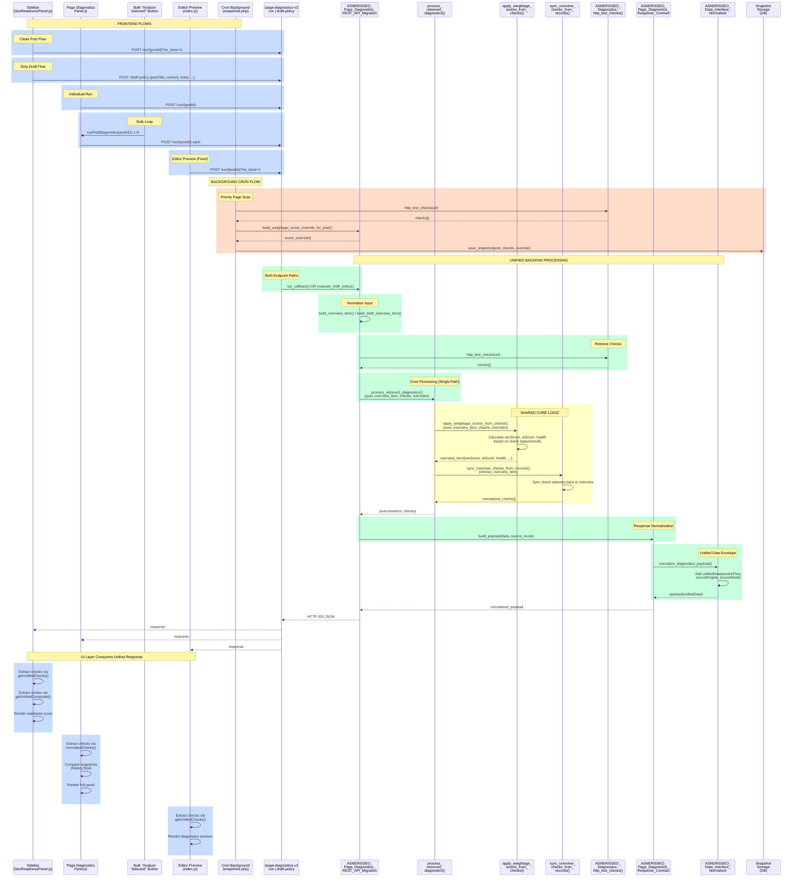

# Unified Page Diagnostics Processing - Sequence Diagram

## All Consumption Flows (Aligned to v2)

## Key Design Principles

| Component | Purpose | Used By |
|-----------|---------|---------|
| **Sidebar** | Readiness score in editor sidebar | Live post or draft |
| **Panel** | Full diagnostics history & comparison | Priority/non-priority pages |
| **Bulk Button** | Multi-page analysis in sequence | Loop calls `runPostDiagnostics()` |
| **Editor Preview** | Quick diagnostic preview in editor | Live post only (v2 run) |
| **Cron** | Background priority page scanning | Scheduled every N hours |
| **/run endpoint** | Live post diagnostics + snapshots | Posted content (published/live) |
| **/draft-policy endpoint** | Draft/unsaved content analysis | Editor dirty state |
| **process_retrieved_diagnostics()** | **UNIFIED CORE** | All endpoints converge here |
| **apply_weightage_scores_from_checks()** | **UNIFIED SCORING** | Converts checks → seoScore, aiScore |
| **sync_overview_checks_from_records()** | **UNIFIED SYNC** | Propagates check status → overview |
| **Response Contract** | **UNIFIED SHAPE** | All responses normalized to same schema |
| **Cron Snapshot Storage** | Persistent history for trending | Non-v2 path; uses v2 scorer only |

## Rule Compliance Status

✅ **"Data value difference only at endpoint process" (Orchestration layer)**
- Sidebar chooses endpoint based on dirty state
- Panel chooses endpoint based on editor context
- Bulk loops individual runs (each chooses endpoint)
- Editor Preview always uses /run (clean)
- Cron uses background scoring (v2 only, no legacy fallback)

✅ **"All 3 flows must be same except their screen orchestration"**
1. Sidebar orchestration: Editor state → endpoint choice → render score badge
2. Panel orchestration: History loops, comparisons, pagination → render full details
3. Bulk orchestration: Loop selected items → sequential runs
4. Editor orchestration: Quick preview → minimal render
5. Cron orchestration: Background loop → store snapshots

✅ **Core Feature Identical Across All:**
- `process_retrieved_diagnostics()` always called (no branching)
- `apply_weightage_scores_from_checks()` always called (no branching)
- `sync_overview_checks_from_records()` always called (no branching)
- Response contract always applied (no branching)

✅ **No Legacy Fallbacks:**
- Cron uses v2 scorer only (no legacy REST_API fallback)
- Editor preview migrated to v2 run (no legacy overview)
- Sidebar aligned to v2 endpoints (both dirty and clean)
- Panel inherits v2 endpoints (both runs and draft-policy)
- Bulk reuses `runPostDiagnostics()` (already v2 aligned)
